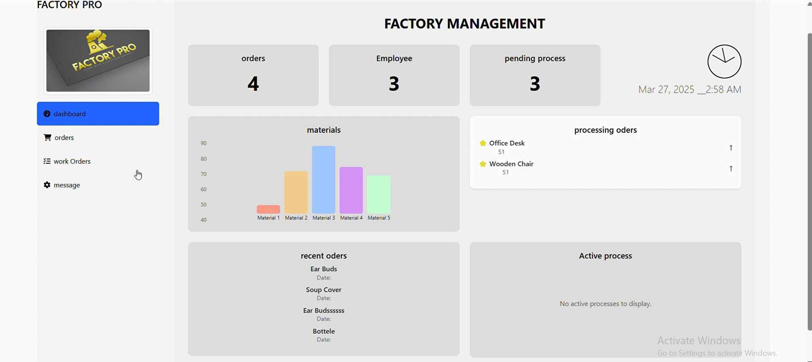
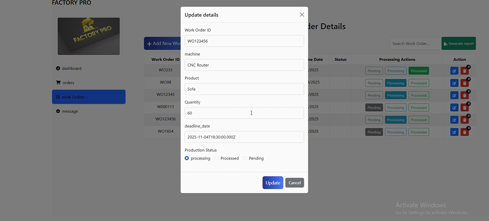
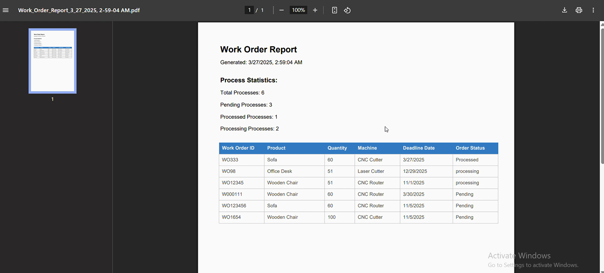
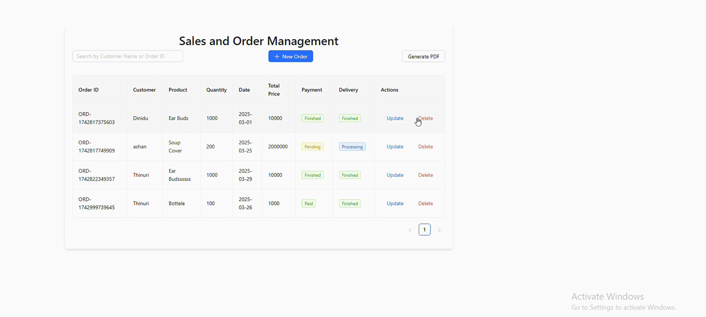
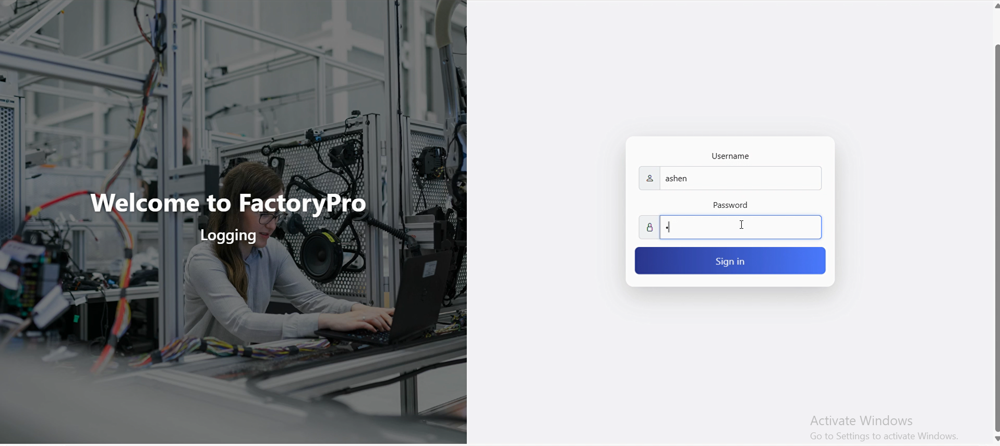
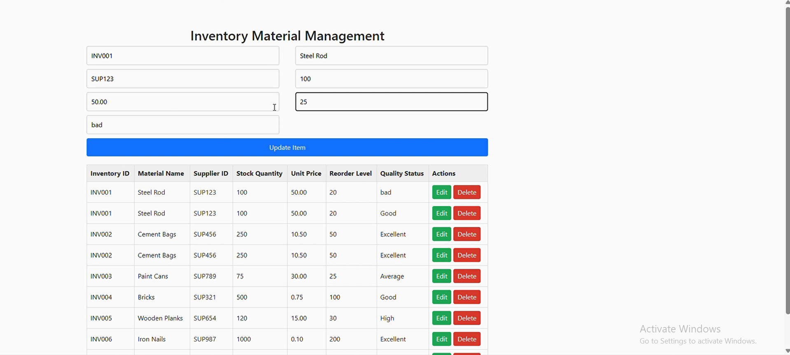
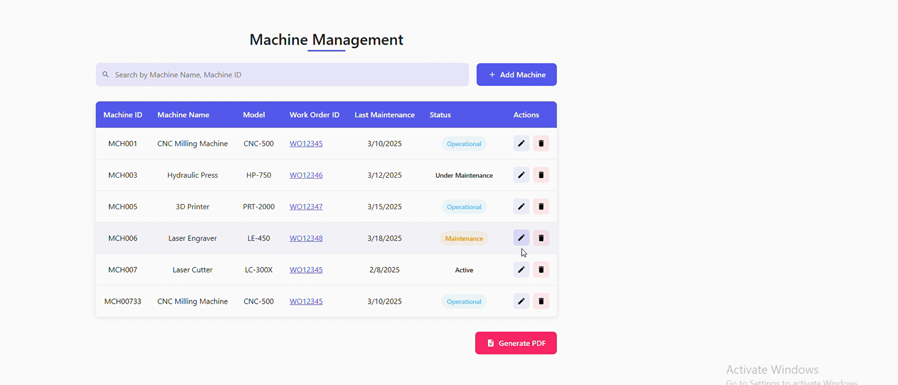
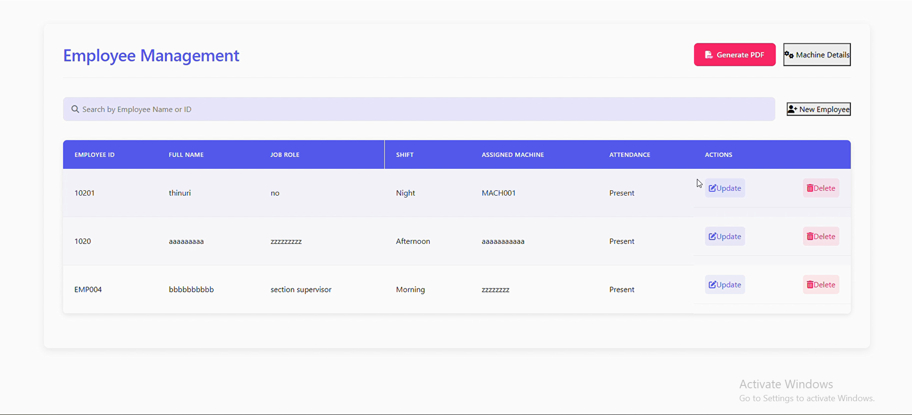

# Factory Management System

A web-based application to help factories oversee and control all key operations.  
This system is divided into four main modules:

1. **Production & Work Order Management**  
2. **Inventory & Raw Material Management**  
3. **Machine & Employee Management**  
4. **Sales & Order Management**

---

## Table of Contents
- [Features](#features)  
- [Tech Stack](#tech-stack)  
- [Installation](#installation)  
- [Usage](#usage)  
- [Project Structure](#project-structure)  
- [Screenshots](#screenshots)  
- [Contributing](#contributing)  
- [License](#license)  

---

## Features

### 1. Production & Work Order Management
- Create and schedule production jobs  
- Track work orders from start to finish  
- Monitor production status and output quantities  

### 2. Inventory & Raw Material Management
- Maintain records of raw materials and stock levels  
- Generate low-stock alerts  
- Record material consumption per work order  

### 3. Machine & Employee Management
- Register and track machines with maintenance schedules  
- Assign employees to machines and shifts  
- Log machine usage and downtime  

### 4. Sales & Order Management
- Enter customer orders and invoices  
- Track order status (pending, in production, shipped)  
- View sales reports and order history  

---

## Tech Stack
- **Frontend:** React (or Angular/Vue)  
- **Backend:** Node.js + Express (or Spring Boot/Django)  
- **Database:** MongoDB (or MySQL/PostgreSQL)  
- **Authentication:** JSON Web Tokens (JWT)  
- **Deployment:** Docker, Kubernetes  

---

## Installation

1. **Clone the repo**
   ```bash
   git clone https://github.com/your-username/factory-management-system.git
   cd factory-management-system
2. Install dependencies
   # Frontend
      cd FRONEND
      npm install
   
   # Backend
   cd ../backend
   npm install
3. Configure environment
   Copy backend/.env.example to backend/.env
   Set your MONGO_URI, JWT_SECRET, and other required variables
4.Start the services
   # Backend
   cd backend
   npm run dev
   # Frontend (new terminal)
   cd FRONEND
   npm start

## Usage

Access the frontend at http://localhost:3000
Backend runs at http://localhost:5000 (default)
Login with your credentials or create a new account
Start managing work orders, inventory, machines, and sales 


## Project Structure
factory-management-system/
│── FRONEND/        # React frontend (public/ contains screenshots)  
│── backend/        # Node.js + Express backend  
│── server/         # API, controllers, and routes  
│── database/       # DB models and schema  
│── docs/           # Documentation  
│── README.md


## Screenshots

### Welcome & Access
- **Welcome Page**  
  

- **Manager Login**  
  

### Production & Work Orders
- **Dashboard – Production & Work Orders**  
  

- **Work Order – Status Update**  
  

- **Summary Report (PDF preview)**  
  

### Sales & Orders
- **Sales & Order Management**  
  

- **Manager Login (Sales module)**  
  

### Inventory & People/Assets
- **Inventory & Raw Material Management**  
  

- **Machine Management**  
  

- **Employee Management**  
  

## Contributing

   Fork & Clone your repo
   git clone https://github.com/your-username/factory-management-system.git
   
   
   Create a feature branch
   git checkout -b feature/your-feature-name
   
   
   Install dependencies & run tests
   Commit changes with a clear message
   git commit -m "Add validation to work order form"
   Push your branch and open a Pull Request against main


  ## License
      
      Built with ❤️ to streamline factory operations.
      © 2025 SLIIT
